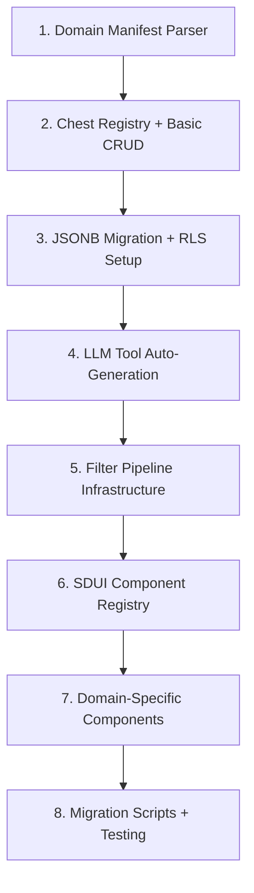

# Research: ARCHITECTURE patterns for rebuilding a FastAPI + React AI coaching platform into a domain-agnostic system

## Summary

Transforming a finance-specific FastAPI + React platform into a domain-agnostic "Chest + Domain Manifest" architecture requires careful balance of flexibility and structure. Key findings: **Hybrid YAML + Python packages** for Domain Manifests, **JSONB with typed accessors** for schema flexibility, **middleware-based filter pipelines** in FastAPI, **component registry pattern** for auto-generated LLM tools, and **SDUI integration** via React component registries.

## Findings

### 1. Chest Registry → Auto-Generated LLM Tools Pattern

**Registry-driven tool generation** eliminates manual LLM tool definitions by auto-generating FastAPI tool schemas from chest metadata.

```python
# Chest metadata drives tool generation
@dataclass
class ChestMetadata:
    name: str
    schema: JSONSchema  # JSON Schema for data structure
    searchable_fields: List[str]  # BM25 indexable fields
    filters: List[FilterSpec]  # Available filter operations
    permissions: PermissionSpec

class LLMToolGenerator:
    """Auto-generates LLM tool definitions from chest registry"""
    
    def generate_tools(self, registry: ChestRegistry) -> List[ToolDefinition]:
        tools = []
        for chest_name, metadata in registry.get_all():
            # Search tool
            tools.append(self._create_search_tool(chest_name, metadata))
            # Filter tool  
            tools.append(self._create_filter_tool(chest_name, metadata))
            # Aggregate tool (if applicable)
            if metadata.supports_aggregation:
                tools.append(self._create_aggregate_tool(chest_name, metadata))
        return tools
    
    def _create_search_tool(self, name: str, meta: ChestMetadata) -> ToolDefinition:
        return ToolDefinition(
            name=f"search_{name}",
            description=f"Search {name} by text query",
            parameters={
                "query": {"type": "string", "description": f"Search query for {name}"},
                "limit": {"type": "integer", "default": 10, "maximum": 50}
            }
        )
```

**JSON Schema → Tool Definition Pipeline**: Use libraries like `jsonschema-to-openapi` to convert chest schemas into OpenAPI tool definitions that LLMs can call. This eliminates drift between data structure and available operations. [Source](https://pypi.org/project/jsonschema-to-openapi/)

### 2. Domain Manifest Structure: Hybrid YAML + Python Approach

**Recommended**: Hybrid approach with YAML for declarative config and Python packages for complex logic.

```yaml
# domains/finance/manifest.yaml
domain: "finance"
version: "1.2.0"
description: "Financial coaching and document analysis"

chests:
  - name: "transactions"
    schema: "schemas/transaction.schema.json"
    indexable_fields: ["description", "category", "merchant"]
    filters:
      - field: "amount"
        operators: ["gte", "lte", "eq"]
      - field: "date" 
        operators: ["after", "before", "between"]
      - field: "category"
        operators: ["eq", "in"]
    
  - name: "financial_goals"
    schema: "schemas/goal.schema.json"
    indexable_fields: ["title", "description"]

personas:
  - name: "budget_coach"
    config: "personas/budget_coach.json"
    prompt_template: "prompts/budget_coach.j2"
    model: "gemini-3-flash"
    
ui_components:
  - type: "calculator"
    implementation: "components.calculators.loan_calculator"
  - type: "chart"
    implementation: "components.charts.spending_chart"

filters:
  pipeline:
    - "auth.validate_user"
    - "rls.set_tenant_context"  
    - "finance.validate_account_access"
    - "audit.log_data_access"

enrichment:
  - processor: "finance.transaction_categorizer"
    trigger: "on_transaction_create"
  - processor: "finance.goal_progress_calculator"
    trigger: "on_transaction_create"
```

```python
# domains/finance/processors.py - Complex logic in Python
class TransactionCategorizer:
    """Domain-specific transaction categorization logic"""
    
    def process(self, transaction: Transaction, context: ProcessingContext) -> Transaction:
        # Complex ML-based categorization
        category = self.ml_model.predict(transaction.description)
        return transaction.with_category(category)

# domains/finance/__init__.py - Domain package entry point
from .processors import TransactionCategorizer
from .validators import FinanceValidator
from .ui import CalculatorComponents

DOMAIN_COMPONENTS = {
    "processors": [TransactionCategorizer()],
    "validators": [FinanceValidator()],
    "ui_components": CalculatorComponents(),
}
```

**Benefits of hybrid approach**:
- **YAML**: Human-readable, version-controllable, easy for non-developers to modify
- **Python packages**: Full programming power for complex domain logic, proper dependency management, testing
- **Clean separation**: Declarative structure vs. imperative behavior

[Source](https://callsphere.tech/blog/configuration-as-code-ai-agents-yaml-toml-python-patterns)

### 3. Database Schema Strategy: JSONB with Typed Accessors

**Recommended**: JSONB storage with domain-specific typed accessors, avoiding schema-per-domain complexity.

```python
# Core polymorphic tables
class ChestItem(Base):
    __tablename__ = "chest_items"
    
    id: Mapped[UUID] = mapped_column(primary_key=True)
    chest_name: Mapped[str] = mapped_column(index=True)
    domain: Mapped[str] = mapped_column(index=True) 
    data: Mapped[dict] = mapped_column(JSON)  # JSONB storage
    created_at: Mapped[datetime] = mapped_column(default=datetime.utcnow)
    tenant_id: Mapped[UUID] = mapped_column(ForeignKey("tenants.id"), index=True)

    __table_args__ = (
        Index("ix_chest_tenant", "chest_name", "tenant_id"),
        Index("ix_domain_tenant", "domain", "tenant_id"),
    )

# Domain-specific typed accessors
class FinanceTransaction:
    """Typed accessor for transaction data in JSONB"""
    
    def __init__(self, chest_item: ChestItem):
        self._item = chest_item
        self._data = chest_item.data
    
    @property 
    def amount(self) -> Decimal:
        return Decimal(str(self._data["amount"]))
    
    @property
    def description(self) -> str:
        return self._data["description"]
        
    @property
    def category(self) -> Optional[str]:
        return self._data.get("category")
    
    def to_dict(self) -> dict:
        return {
            "id": str(self._item.id),
            "amount": float(self.amount),
            "description": self.description,
            "category": self.category,
            "date": self._data["date"]
        }

# Registry maps chest names to accessor classes
CHEST_ACCESSORS = {
    "transactions": FinanceTransaction,
    "goals": FinanceGoal,
    "accounts": FinanceAccount,
}
```

**RLS for Multi-Tenancy**: Use PostgreSQL Row-Level Security instead of schema-per-tenant for operational simplicity while maintaining data isolation.

```sql
-- Enable RLS on chest_items
ALTER TABLE chest_items ENABLE ROW LEVEL SECURITY;

-- Policy: users can only access their tenant's data
CREATE POLICY tenant_isolation ON chest_items
    FOR ALL TO app_role
    USING (tenant_id = current_setting('app.current_tenant_id')::UUID);
```

**Why JSONB wins over separate tables**:
- **Schema evolution**: Add new fields without migrations
- **Cross-domain queries**: Single table for analytics and operations
- **Operational simplicity**: One backup, one index strategy, one connection pool
- **Developer velocity**: No per-domain table management

[Source](https://appmaster.io/blog/postgresql-jsonb-vs-normalized-tables)

### 4. FastAPI Filter Pipeline Implementation

**Middleware-based pipeline** with per-domain configuration and dependency injection.

```python
# Core filter pipeline infrastructure
class FilterPipeline:
    def __init__(self):
        self.filters: List[Filter] = []
        
    def add_filter(self, filter_instance: Filter):
        self.filters.append(filter_instance)
        
    async def execute(self, request: Request, context: RequestContext):
        for filter_instance in self.filters:
            context = await filter_instance.process(request, context)
            if context.should_abort:
                return context.abort_response
        return context

# Domain-specific middleware registration  
class DomainFilterMiddleware:
    def __init__(self, domain_registry: DomainRegistry):
        self.domain_registry = domain_registry
        
    async def __call__(self, request: Request, call_next):
        # Extract domain from path/header
        domain = self._extract_domain(request)
        
        if domain and domain in self.domain_registry:
            # Build domain-specific filter pipeline
            manifest = self.domain_registry.get_manifest(domain)
            pipeline = self._build_pipeline(manifest.filters.pipeline)
            
            # Execute pipeline
            context = RequestContext(domain=domain)
            result = await pipeline.execute(request, context)
            if result.should_abort:
                return result.abort_response
                
        response = await call_next(request)
        return response

# Example domain filters
class FinanceAccountAccessFilter(Filter):
    async def process(self, request: Request, context: RequestContext):
        # Check if user has access to requested financial accounts
        if "account_id" in request.path_params:
            account_id = request.path_params["account_id"]
            if not await self._user_owns_account(context.user_id, account_id):
                context.abort_with_error("Account access denied", 403)
        return context

class AuditLogFilter(Filter):
    async def process(self, request: Request, context: RequestContext):
        # Log all data access for compliance
        await audit_service.log_access(
            user_id=context.user_id,
            domain=context.domain,
            action=request.method,
            resource=request.url.path
        )
        return context
```

**Configuration-driven registration**:
```python
# Domain manifest defines filter pipeline order
def configure_domain_filters(app: FastAPI, domain_manifest: DomainManifest):
    filter_map = {
        "auth.validate_user": AuthValidationFilter(),
        "rls.set_tenant_context": TenantContextFilter(), 
        "finance.validate_account_access": FinanceAccountAccessFilter(),
        "audit.log_data_access": AuditLogFilter(),
    }
    
    pipeline = FilterPipeline()
    for filter_name in domain_manifest.filters.pipeline:
        if filter_name in filter_map:
            pipeline.add_filter(filter_map[filter_name])
            
    app.add_middleware(DomainFilterMiddleware, pipeline=pipeline)
```

[Source](https://deepwiki.com/fastapi-practices/fastapi_best_architecture/5.1-middleware-stack)

### 5. SDUI Integration with React + Tailwind

**Component Registry Pattern** for server-driven UI using existing React + Tailwind components.

```typescript
// Component registry maps server types to React components
interface SDUIComponent {
  type: string;
  component: React.ComponentType<any>;
  schema: JSONSchema7;
}

class ComponentRegistry {
  private components = new Map<string, SDUIComponent>();
  
  register(componentDef: SDUIComponent) {
    this.components.set(componentDef.type, componentDef);
  }
  
  resolve(type: string): SDUIComponent | null {
    return this.components.get(type) || null;
  }
  
  getSupportedTypes(): string[] {
    return Array.from(this.components.keys());
  }
}

// Register domain-specific components
const registry = new ComponentRegistry();

// Built-in primitives
registry.register({
  type: "text",
  component: Text,
  schema: textSchema
});

registry.register({
  type: "button", 
  component: Button,
  schema: buttonSchema
});

// Finance domain components
registry.register({
  type: "loan_calculator",
  component: LoanCalculator,
  schema: loanCalculatorSchema
});

registry.register({
  type: "spending_chart",
  component: SpendingChart,
  schema: spendingChartSchema
});

// SDUI renderer with fallback handling
function SDUIRenderer({ layout, registry }: SDUIRendererProps) {
  const renderComponent = (node: SDUINode): React.ReactNode => {
    const componentDef = registry.resolve(node.type);
    
    if (!componentDef) {
      // Fallback for unknown components
      console.warn(`Unknown component type: ${node.type}`);
      return <div className="p-4 border-2 border-red-200 rounded bg-red-50">
        Component "{node.type}" not found
      </div>;
    }
    
    const Component = componentDef.component;
    return (
      <Component 
        key={node.id}
        {...node.props}
      >
        {node.children?.map(renderComponent)}
      </Component>
    );
  };
  
  return <div className="sdui-container">{layout.children.map(renderComponent)}</div>;
}
```

**Action System for Interactions**:
```typescript
// Server-driven actions with type safety
interface Action {
  type: 'navigate' | 'api_call' | 'state_update' | 'sequence';
}

interface NavigateAction extends Action {
  type: 'navigate';
  destination: string;
  params?: Record<string, string>;
}

interface ApiCallAction extends Action {
  type: 'api_call';
  url: string;
  method: 'GET' | 'POST' | 'PUT' | 'DELETE';
  data?: any;
  onSuccess?: Action;
  onError?: Action;
}

class ActionHandler {
  constructor(
    private router: Router,
    private apiClient: ApiClient,
    private stateStore: StateStore
  ) {}
  
  async execute(action: Action): Promise<void> {
    switch (action.type) {
      case 'navigate':
        const navAction = action as NavigateAction;
        this.router.push(navAction.destination);
        break;
        
      case 'api_call':
        const apiAction = action as ApiCallAction;
        try {
          const result = await this.apiClient.request(apiAction.url, {
            method: apiAction.method,
            data: apiAction.data
          });
          if (apiAction.onSuccess) {
            await this.execute(apiAction.onSuccess);
          }
        } catch (error) {
          if (apiAction.onError) {
            await this.execute(apiAction.onError);
          }
        }
        break;
    }
  }
}
```

[Source](https://pyramidui.com/blog/sdui-architecture-patterns)

### 6. Build Order for Refactor

**Recommended implementation sequence** to unblock subsequent development:



**Phase 1: Foundation (Week 1-2)**
- Domain manifest YAML parser
- Basic chest registry with metadata storage
- Core polymorphic database tables with JSONB

**Phase 2: Data Layer (Week 3-4)**  
- Migrate existing finance data to JSONB format
- Implement typed accessors for finance domain
- Set up RLS policies and tenant context

**Phase 3: Tool Generation (Week 5-6)**
- Auto-generate LLM tools from chest schemas  
- Update LLM routing to use generated tools
- Test with existing finance use cases

**Phase 4: Filtering (Week 7-8)**
- Implement filter pipeline infrastructure
- Port existing middleware to new pattern
- Add finance-specific filters

**Phase 5: UI Layer (Week 9-10)**
- React component registry
- SDUI renderer with fallback handling
- Port existing coaching cards to SDUI format

**Phase 6: Polish (Week 11-12)**
- Domain-specific components (calculators, charts)
- Migration scripts for existing users
- End-to-end testing with new architecture

## Integration Points with Existing Code

### Current Architecture Integration

**Database Migration Strategy**:
```python
# Gradual migration approach
class HybridDataAccess:
    """Bridges old finance tables with new JSONB storage"""
    
    async def get_user_transactions(self, user_id: UUID) -> List[Transaction]:
        # Check new JSONB storage first
        jsonb_transactions = await self._get_from_chest("transactions", user_id)
        if jsonb_transactions:
            return [FinanceTransaction(item).to_dict() for item in jsonb_transactions]
            
        # Fall back to legacy tables during migration
        return await self._get_from_legacy_tables(user_id)
```

**LLM Client Integration**:
```python
# Extend existing llm_client.py to use generated tools
class EnhancedLLMClient(LLMClient):
    def __init__(self, chest_registry: ChestRegistry):
        super().__init__()
        self.tool_generator = LLMToolGenerator()
        self.available_tools = self.tool_generator.generate_tools(chest_registry)
    
    async def complete(self, route: str, **kwargs) -> str:
        # Add generated tools to completion call
        kwargs['tools'] = self.available_tools
        return await super().complete(route, **kwargs)
```

**Content Catalog Evolution**:
```python
# Extend BM25 content search to work with chest data
class UnifiedContentSearch:
    def __init__(self, content_catalog: ContentCatalog, chest_registry: ChestRegistry):
        self.content_search = BM25ContentSearch(content_catalog)
        self.chest_search = ChestSearchEngine(chest_registry)
    
    def search(self, query: str, domain: str, user_id: UUID) -> SearchResults:
        # Search static content catalog
        content_results = self.content_search.search(query, locale="it")
        
        # Search user's chest data
        chest_results = self.chest_search.search(query, domain, user_id)
        
        return SearchResults.combine(content_results, chest_results)
```

## Sources

**Kept:**
- **SDUI Architecture Patterns** (pyramidui.com) — Comprehensive patterns for server-driven UI with component registries, action systems, and React integration
- **Multi-Tenant SaaS Architecture** (hunchbite.com) — Detailed comparison of RLS vs schema-per-tenant with PostgreSQL implementation specifics  
- **FastAPI Middleware Stack** (deepwiki.com) — Production-grade middleware pipeline patterns with dependency injection and per-route configuration
- **PostgreSQL JSONB vs normalized tables** (appmaster.io) — Decision framework for schema flexibility vs structure with performance considerations
- **Plugin Architecture Patterns** (oneuptime.com) — Registry pattern and dynamic loading for extensible Python systems
- **Configuration-as-Code Patterns** (callsphere.tech) — YAML vs Python tradeoffs for agent/domain configuration systems

**Dropped:**
- Generic microservices patterns — too broad for specific FastAPI + React context
- OpenAPI generator tools — less relevant than schema-first tool generation approach  
- Abstract DDD theory — focused on concrete FastAPI implementation patterns instead

## Gaps

**Performance optimization** for JSONB queries at scale not fully covered. **Specific migration tooling** for finance→generic domain transformation needs custom development. **Testing strategies** for domain-agnostic architecture need exploration.

**Suggested next steps**: Prototype chest registry + JSONB migration on subset of finance data. Build LLM tool auto-generation MVP. Validate SDUI renderer with existing coaching cards.